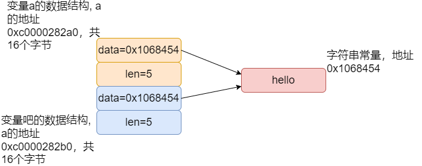

> 了解字符串类型的数据结构

> 了解如何通过`reflect`进行指针类型转换

> 了解如何通过`reflect`把指针类型转换uint

[reflect.StringHeader](https://github.com/golang/go/blob/go1.22.0/src/reflect/value.go#L2840)是Go语言中`reflect`包内部使用的一个结构体,用于表示字符串在运行时的底层结构.这个结构体有两个字段:
Data 和 Len,分别代表字符串底层数据的内存地址和字符串的长度。

```go
// StringHeader is the runtime representation of a string.
// It cannot be used safely or portably and its representation may
// change in a later release.
// Moreover, the Data field is not sufficient to guarantee the data
// it references will not be garbage collected, so programs must keep
// a separate, correctly typed pointer to the underlying data.
//
// Deprecated: Use unsafe.String or unsafe.StringData instead.
type StringHeader struct {
    Data uintptr
    Len  int
}
```

**分析过程**
 
```go
package main

import (
    "fmt"
    "reflect"
    "unsafe"
)

func main() {
    a := "hello"
    b := a
    size_of_string := unsafe.Sizeof(a)
    a_ref := (*reflect.StringHeader)(unsafe.Pointer(&a))
    b_ref := (*reflect.StringHeader)(unsafe.Pointer(&b))
    fmt.Printf("address of a %p, address of a data=0x%x\n", &a, a_ref.Data)
    fmt.Printf("address of b %p, address of b data=0x%x\n", &b, b_ref.Data)
    fmt.Printf("size_of_string = %d\n", size_of_string)
    addr_a_uint := uintptr(unsafe.Pointer(&a))
    addr_b_uint := uintptr(unsafe.Pointer(&b))
    fmt.Printf("address offset of a and b  = %d\n", addr_b_uint-addr_a_uint)
}
```
输出如下
```
address of a 0xc0000282a0, address of a data=0x1068454
address of b 0xc0000282b0, address of b data=0x1068454
size_of_string = 16
address offset of a and b  = 16
```

先用图把上述的内存地址布局展示下



解释下上面的代码

- fmt: 用于格式化输出
- reflect: 提供了运行时反射的能力,可以查询变量的类型信息
- unsafe: 用于执行不安全操作的函数,比如将任意类型的指针转换为其他类型的指针

字符串变量 a 和 b指向同一个字符串字面量 "hello",在 Go 中,字符串是不可变的 ,并且当多个变量指向同一个字符串字面量时,它们会共享底层的数据。

下面的代码使用`reflect.StringHeader`和`unsafe.Pointer`来获取字符串的底层表示和内存地址
```go
a_ref := (*reflect.StringHeader)(unsafe.Pointer(&a))  
b_ref := (*reflect.StringHeader)(unsafe.Pointer(&b))
```

`reflect.StringHeader`是一个结构体，它描述了 Go 语言中字符串的内部表示.它有两个字段：Data和Len，分别表示字符串底层数据的地址和长度。
```go
type StringHeader struct {
    Data uintptr
    Len  int
}
```
`unsafe.Pointer`是一个特殊的指针类型,可以转换为任意类型的指针.这里,我们使用它将 `&a` 和 `&b`(即 a 和 b 的地址)转换为 `unsafe.Pointer`,然后再转换为 `*reflect.StringHeader`类型的指针

`&a`和`&b`是`a`和`b`的地址，而`a_ref.Data`和`b_ref.Data`是`a`和`b`底层数据的地址。

下面的代码把地址指针转换成uint,主要是用来计算下2个地址的offset有多少,从打印来看是16,正好等于`reflect.StringHeader`的size,说明2个变量的地址是**紧邻**的.
```
addr_a_uint := uintptr(unsafe.Pointer(&a))
addr_b_uint := uintptr(unsafe.Pointer(&b))
fmt.Printf("address offset of a and b  = %d\n", addr_b_uint-addr_a_uint)
```

```
size_of_string = 16
address offset of a and b  = 16
```